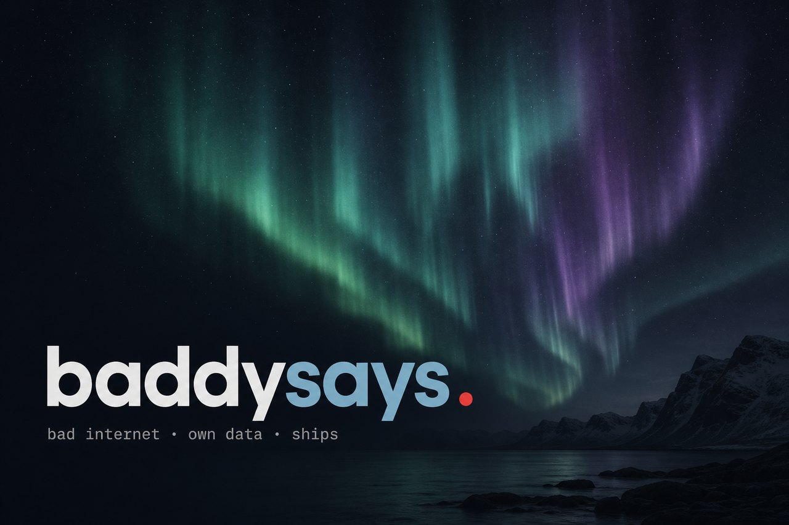

<p align="center">
  
</p>

<p align="center">
  <code>MSK · на связи · <a href="https://baddysays.ru">baddysays.ru</a></code>
</p>

<p align="center">
  <a href="https://baddysays.ru"></a>
  <a href="mailto:hello@baddysays.ru"></a>
  <a href="https://t.me/baddysays"></a>
  <a href="https://sea.baddysays.ru"></a>
</p>

<p align="center">
  
</p>

### About

Делаю то, чем потом пользуются — даже при плохом интернете и без чужого облака.

От задумки до запуска: интерфейс, сервер, выкладка. После запуска тоже на связи.

<details>
<summary><strong>EN</strong></summary>

<br/>

I build things people use — even on bad internet, without someone else’s cloud.

From idea to launch: interface, server, deploy. After launch I stay reachable.
</details>

### Works

| | | |
| :--- | :--- | :--- |
| **[Saylat](https://github.com/Baddysays/Saylat)** | browser for bad internet | [live](https://saylat.baddysays.ru) · [releases](https://github.com/Baddysays/Saylat/releases) |
| **[Wernanmail](https://github.com/Baddysays/wernanmail)** | mail on your own server | [site](https://wernanmail.ru) · [repo](https://github.com/Baddysays/wernanmail) |
| **[Etemenanki](https://github.com/Baddysays/Etemenanki)** | translation at home | [releases](https://github.com/Baddysays/Etemenanki/releases) |
| **[Foxik](https://github.com/Baddysays/foxik-dispatcher)** | shift notes, fast | [live](https://foxik.baddysays.ru) |

Сервер упрощает страницу · своя почта · локальная модель · мало экранов — так и задумано.

### Stack

`Kotlin · Compose · Go · Python · FastAPI · Qt · React · Vite · Docker · Mailcow · Prometheus`

Self-hosted when it matters. Local AI when data shouldn’t leave.

### Now

```
project · together · ongoing
отвечаю днём по Москве
```

<p align="center">
  <a href="mailto:hello@baddysays.ru">hello@baddysays.ru</a>
  ·
  <a href="https://t.me/baddysays">telegram</a>
  ·
  <a href="https://baddysays.ru/contact/">написать</a>
</p>
