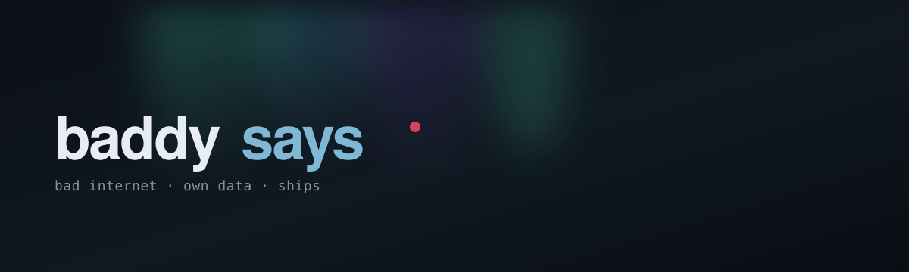

<!-- github.com/Baddysays profile README -->

  

  
  &nbsp;
  
  &nbsp;
  

 

### Привет — я **baddysays**
**Product engineer.** Делаю вещи, которыми можно пользоваться сегодня: Android, сервера, десктоп, веб. Не пет-проекты «на потом» — релиз, APK, инсталлер, демо.

Hey — I'm **baddysays**. I ship products end-to-end: mobile, backend, desktop, web. Real releases. Real users. Clear craft.

  

## Что я строю · What I ship

<table>
<tr>
<td width="50%" valign="top">

### [Saylat](https://github.com/Baddysays/Saylat)
**Браузер для медленного интернета**  
Personal-first Android + VPS: сжатие Light/Medium/Full, STRIPS, офлайн-ядро. Сайты и мессенджеры — когда сеть еле дышит.

 
[Kotlin · Python · Android](https://github.com/Baddysays/Saylat) · [saylat.baddysays.ru](https://saylat.baddysays.ru)

</td>
<td width="50%" valign="top">

### [Etemenanki](https://github.com/Baddysays/Etemenanki)
**AI-переводчик документов**  
Windows-приложение на Qt 6: PDF / DOCX / TXT → перевод через Ollama или OpenAI-compatible API. Локально. Без облачного рабства.

 
[C++ · Qt/QML · Python](https://github.com/Baddysays/Etemenanki)

</td>
</tr>
<tr>
<td width="50%" valign="top">

### [Foxik Dispatcher](https://github.com/Baddysays/foxik-dispatcher)
**Операционный дашборд**  
React 19 + Vite 6: KPI смены, аналитика наблюдателей, импорт JSON, AI worklog. Живое демо.

 
[React · Vite](https://github.com/Baddysays/foxik-dispatcher) · [foxik.baddysays.ru](https://foxik.baddysays.ru)

</td>
<td width="50%" valign="top">

### Как я работаю · How I work
- **От идеи до релиза** — CI, APK, setup.exe, docs
- **Продуктовое мышление** — UX под реальный constraint (2G, офлайн, локальный AI)
- **Чистый ownership** — один человек, полный цикл, без «это не моя зона»

</td>
</tr>
</table>

  

## Стек · Stack

  
  
  
  
  
  
  
  
  

 

## Цифры · Pulse

  
  

  

  

## Давай работать · Let's talk

Нужен человек, который **сам доведёт продукт до релиза** — напиши.  
Need someone who owns the full loop and ships? Reach out.

  
  &nbsp;
  
  &nbsp;
  

---

  built with intent · maintained like a product · © baddysays

