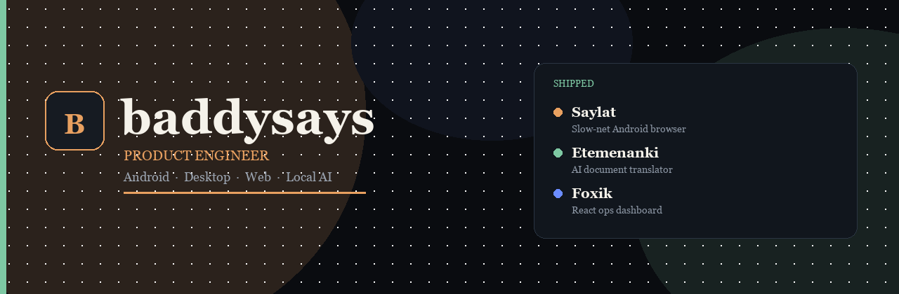

  

  

  
  
  

---

### About

I ship products end-to-end — not slides, not half-repos.

- **Ownership** — idea → CI → release (APK / setup.exe) → docs → users
- **Constraint-driven** — slow networks, offline, local AI
- **Stack** — Kotlin / Android · Python · C++ / Qt · React
- **Open to hire** for serious product work → [hello@baddysays.ru](mailto:hello@baddysays.ru)

### Tech

  

### Products

| | Project | What it is | Links |
|:--:|:--|:--|:--|
| 01 | **[Saylat](https://github.com/Baddysays/Saylat)** | Browser for 2G / slow nets — Android client + VPS compression | [release](https://github.com/Baddysays/Saylat/releases) · [site](https://saylat.baddysays.ru) |
| 02 | **[Etemenanki](https://github.com/Baddysays/Etemenanki)** | Local AI document translator — Qt 6 + Ollama / OpenAI-compatible | [release](https://github.com/Baddysays/Etemenanki/releases) |
| 03 | **[Foxik Dispatcher](https://github.com/Baddysays/foxik-dispatcher)** | Ops dashboard — shift KPI, analytics, AI worklog (React 19) | [live demo](https://foxik.baddysays.ru) |

  
  
  

### Activity

  

---

  <strong>Need someone who owns the full loop and ships?</strong> 
  <a href="mailto:hello@baddysays.ru">hello@baddysays.ru</a>
  ·
  <a href="https://t.me/baddysays">@baddysays</a>
  ·
  <a href="https://baddysays.ru">baddysays.ru</a>

  

